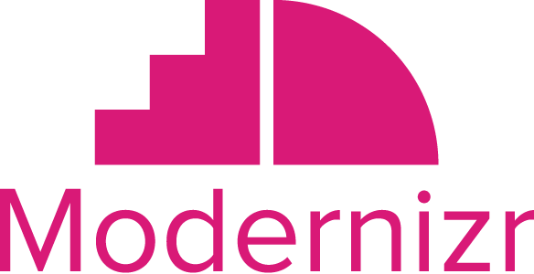

<p align="center">
   <a href="https://www.npmjs.com/package/modernizr" rel="noopener" target="_blank"></a>
</p>

<div align="center">
  
##### Modernizr, kullanıcının tarayıcısındaki HTML5 ve CSS3 özelliklerini algılayan bir JavaScript kütüphanesidir.
  
[](https://badge.fury.io/js/modernizr)
[](https://github.com/Modernizr/Modernizr/actions)
[](https://codecov.io/gh/Modernizr/Modernizr)
[](https://inch-ci.org/github/Modernizr/Modernizr)

</div>

- Bu dosyayı Portekizce-BR dilinde okuyun [here](/README.pt_br.md)
- Bu dosyayı Endonezce okuyun [here](/README.id.md)
- Bu dosyayı İspanyolca okuyun [here](/README.sp.md)
- Bu dosyayı İsveççe okuyun [here](/README.sv.md)
- Bu dosyayı Tamil dilinde okuyun [here](/README.ta.md)
- Bu dosyayı Kannada dilinde okuyun [here](/README.ka.md)
- Bu dosyayı Hintçe olarak okuyun [here](/README.hi.md)

- Web sitemiz eski ve hatalı, lütfen KULLANMAYIN (https://modernizr.com) bunun yerine modernizr sürümünüzü npm'den oluşturun.
- [Documentation](https://modernizr.com/docs/)
- [Integration tests](https://modernizr.github.io/Modernizr/test/integration.html)
- [Unit tests](https://modernizr.github.io/Modernizr/test/unit.html)

Modernizr, mevcut UA'da hangi yerel CSS3 ve HTML5 özelliklerinin bulunduğunu test eder ve sonuçları size iki şekilde sunar: global bir `Modernizr` nesnesi üzerinde özellikler olarak ve `<html>` öğesinde sınıflar olarak. Bu bilgiler, sayfalarınızı deneyim üzerinde ayrıntılı bir kontrolle aşamalı olarak geliştirmenize olanak tanır.

## Breaking changes with v4

- Düğüm sürümleri <= 10 için destek kaldırıldı, lütfen en az sürüm 12'ye yükseltin

- Aşağıdaki testler yeniden adlandırıldı:

  - es-testlerin geri kalanıyla aynı çizgide kalmak için `class`tan `es6class`a

- Aşağıdaki testler alt dizinlere taşındı:

  - `cookies`, `indexeddb`, `indexedblob`, `quota-management-api`, `userdata` storage alt
    dizinine taşındı.
  - `audio` audio alt dizinine taşındı.
  - `battery` battery alt dizinine taşındı.
  - `canvas`, `canvastext` canvas alt dizinine taşındı.
  - `customevent`, `eventlistener`, `forcetouch`, `hashchange`, `pointerevents`, `proximity` event
    alt dizinine taşındı.
  - `exiforientation` image alt dizinine taşındı.
  - `capture`, `fileinput`, `fileinputdirectory`, `formatattribute`, `input`, `inputnumber-l10n`, `inputsearchevent`, `inputtypes`, `placeholder`, `requestautocomplete`, `validation` input
    alt dizinine taşındı.
  - `svg` svg alt dizinine taşındı.
  - `webgl`webgl alt dizinine taşındı.

- Aşağıdaki testler kaldırıldı:

  - `touchevents`: [discussion](https://github.com/Modernizr/Modernizr/pull/2432)
  - `unicode`: [discussion](https://github.com/Modernizr/Modernizr/issues/2468)
  - `templatestrings`: es6'nın kopyası `stringtemplate`i algılar
  - `contains`: es6'nın kopyası `es6string`i algılar
  - `datalistelem`: Modernizr.input.list'in kopyası

## New Asynchronous Event Listeners

Çoğu zaman insanlar, uygulamalarının buna tepki vermesine izin verebilmek için eşzamansız bir testin ne zaman yapıldığını bilmek isterler.
Geçmişte özellikleri izlemeye veya "<html>" sınıflarına güvenmek zorundaydınız. Yalnızca **asynchronous** testler desteklenir.
Hızı artırmak ve tutarlılığı korumak için eşzamanlı testler eşzamanlı olarak ele alınmalıdır.

Yeni API şuna benzer:

```js
// Listen to a test, give it a callback
Modernizr.on("testname", function (result) {
  if (result) {
    console.log("The test passed!");
  } else {
    console.log("The test failed!");
  }
});
```

Fonksiyonunuzu yalnızca bir kez çağıracağımızı garanti ederiz (`on` olarak çağıracağınız her zaman için).
Şu anda `trigger` işlevselliğini ortaya çıkarmak için bir metod göstermiyoruz.
Bunun yerine, eşzamansız testler üzerinde kontrole sahip olmak istiyorsanız,
`src/addTest` özelliğini kullanın, ve ayarladığınız herhangi bir test otomatik olarak `on` fonksiyonunu
ortaya çıkaracak ve tetikleyecektir.

## Getting Started

- Repoyu klonlayın veya indirin
- Proje bağımlılıklarını `npm install` ile yükleyin

## Building Modernizr

### From javascript

Modernizr, npm aracılığıyla programlı olarak kullanılabilir:

```js
var modernizr = require("modernizr");
```

Özel Modernizr yapıları oluşturmak için bir `build` yöntemi kullanıma sunuldu. Örnek:

```javascript
var modernizr = require("modernizr");

modernizr.build({}, function (result) {
  console.log(result); // the build
});
```

İlk parametre, eklenecek seçeneklerden ve özellik algılamalarından oluşan bir JSON nesnesini alır. Mevcut tüm seçenekler için [`lib/config-all.json`](lib/config-all.json) bakın.

İkinci parametre, görev tamamlandığında çağrılan bir fonksiyondur.

### From the command-line

Ayrıca modernizr oluşturmak için bir komut satırı arayüzü de sağlıyoruz.
Tüm mevcut seçenekleri görmek için çalıştırın:

```shell
./bin/modernizr
```

Her şeyi 'config-all.json' dosyasında oluşturmak için npm ile şunu çalıştırın:

```shell
npm start
//outputs to ./dist/modernizr-build.js
```

## Testing Modernizr

Mocha-headless-chrome kullanarak testleri konsolda çalıştırmak için şunu yazın:

```shell
npm test
```

Bu komutla istediğiniz tarayıcıda da testleri çalıştırabilirsiniz:

```shell
npm run serve-gh-pages
```

Ve bu iki URL'e giderek:

```shell
http://localhost:8080/test/unit.html
http://localhost:8080/test/integration.html
```

## Code of Conduct

Bu proje aşağıdaki kurallara uygundur [Open Code of Conduct](https://github.com/Modernizr/Modernizr/blob/master/.github/CODE_OF_CONDUCT.md).
Projeye katılmanız durumunda bu kurallara uymanız bekleniyor.

## License

[MIT License](https://opensource.org/licenses/MIT)
